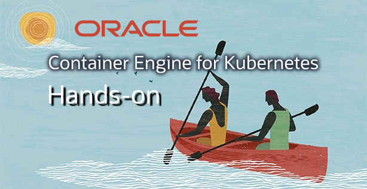
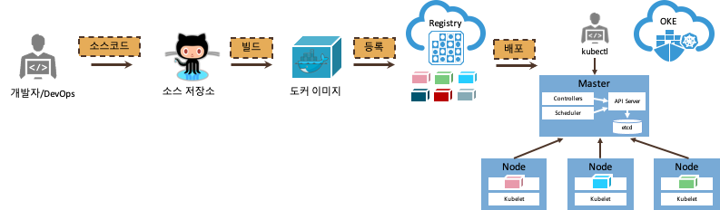

본 핸즈온은 OCI(Oracle Cloud Infrastructure) 기반으로 구성되어 있습니다.

# 클러스터 요구사항

단순히 핸즈온을 실습할 것이라면 다음 요구사항이 필요하지 않습니다.

※ 클러스터와 노트풀을 생성하려는 목적이면 여기를 클릭하세요.

관리자 그룹이면 다음 사항을 적용하지 않아도 됩니다.  

관리자 그룹에 속하지 않지만 클러스터와 노드 풀을 생성, 업데이트 및 삭제해야 하는 경우 다음 사용자 정책 문이 필요합니다.

~~~
allow group <group-name> to manage instance-family in <location>
allow group <group-name> to use subnets in <location>
allow group <group-name> to read virtual-network-family in <location>
allow group <group-name> to use vnics in <location>
allow group <group-name> to inspect compartments in <location>
allow group <group-name> to manage cluster-family in <location>
~~~
위의 정책 명령문에서 &lt;location&gt;을 tenancy(테난시의 루트 구획에 정책을 작성하는 경우) 또는 compartment &lt;compartment-name&gt;(개별 구획에 정책을 작성하는 경우)로 대체합니다.

예제 사용자 정책 문:
~~~
allow group acme-dev-team to manage cluster-family in tenancy
~~~

'QUICK CREATE'와 같은 기능을 위한 OKE IAM 정책에 대한 추가 지침을 보려면 [클러스터 생성 및 배치를 위한 정책 구성](https://docs.cloud.oracle.com/en-us/iaas/Content/ContEng/Concepts/contengpolicyconfig.htm)을 참조하십시오.

# OKE (Container Engine for Kubernets) Hands-on

다음과 같은 절차로 설명합니다.

1. [OKE 클러스터 생성](setup.md)

1. [애플리케이션 작성 및 실행](application.md)

1. [애플리케이션 컨테이너화](docker.md)

1. [애플리케이션 OKE에 배포](oke.md)

1. [애플리케이션 관리](kubectl.md)

