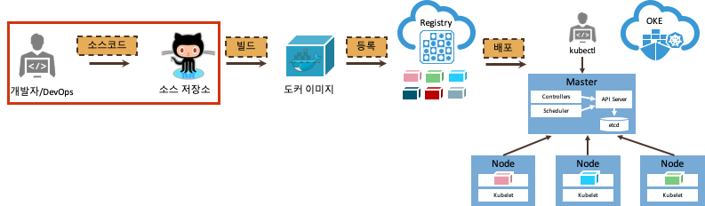
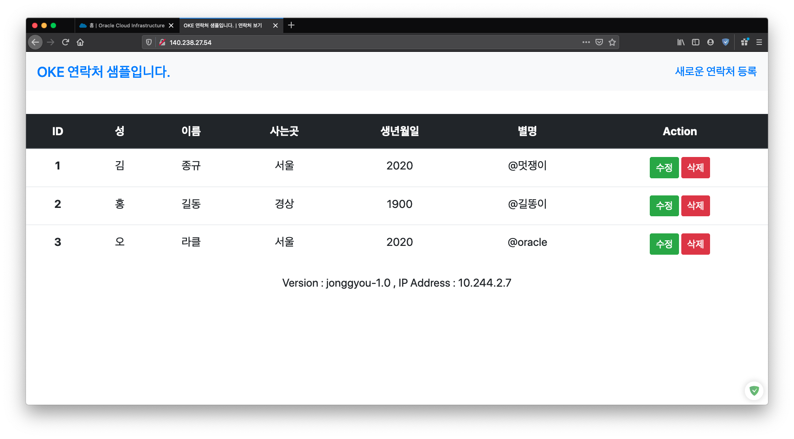

# 애플리케이션 작성 및 실행

핸즈온을 위하여 간단한 애플리케이션을 작성해 보도록 합니다.  
애플리케이션은 다음과 같은 화면을 가집니다.

# 애플리케이션 생성

Node.JS로 만들어진 사용자를 관리하는 애플리케이션을 작성해 보도록 합니다. 이 애플리케이션은 MySQL에 새로운 유저와 테이블을 사용합니다.

애플리케이션의 소스는 미리 만들어진 것을 가져와서 사용하고, MySQL은 미리 만들어진 도커 이미지를 사용하도록 합니다.

1. git 에서 기존에 만들어진 애플리케이션 소스를 가져옵니다.

    ~~~
    git clone https://github.com/jonggyoukim/hands-on-oke-sample
    ~~~

    hands-on-oke-sample 디렉토리로 이동을 합니다.

    ~~~
    cd hands-on-oke-sample
    ~~~

# 데이터베이스 시작
<!--
1. 인스턴스 포트 열기

    ~~~sh
    sudo firewall-cmd --add-port=3306/tcp --permanent
    sudo systemctl restart firewalld
    ~~~
-->

1. MySQL 컨테이너 실행하기

    생성된 네트워크를 이용하는 MySQL을 실행합니다.

    ~~~
    docker run --name mydb -e MYSQL_ROOT_PASSWORD=mypassword -p 3306:3306 -d shiftyou/oke-mysql 
    ~~~

# 애플리케이션 시작
<!--
1. 인스턴스 포트 열기

    ~~~sh
    sudo firewall-cmd --add-port=8080/tcp --permanent
    sudo systemctl restart firewalld
    ~~~
-->

1. 환경설정하기

    해당 애플리케이션은 MySQL에 접속하기 위해서 환경변수가 필요합니다.  
    미리 기동해 놓은 mysql에 대한 설정을 합니다.

    ~~~sh
    export MYSQL_SERVICE_HOST=localhost
    ~~~

1. 애플리케이션 실행하기  

    먼저 관련 패키지를 설치합니다.
    
    ~~~sh
    npm install
    ~~~

    화면이 하나라서 백그라운드로 실행합니다.
    
    ~~~
    npm start &
    ~~~

    다음과 같이 나오면 실행한 것입니다.

    ~~~
    > oke-sample-app@1.0.0 start /home/jonggyou_k/hands-on-oke-sample
    > node app.js

    host:localhost
    user:test
    password:Welcome1
    database:sample
    Server running on port: 8080
    Connected to database
    ~~~

1. 확인

    현재는 Cloud Shell을 사용하여 클라우드의 네트워크를 사용할 수 없어 브라우저로는 접근이 불가능합니다. 그래서 curl로 확인해 보도록 합니다.
    
    ~~~
    curl localhost:8080
    ~~~

    HTML 소스가 보일 것이며 성공한 것입니다.  
    

1. 마치기

    백그라운드로 실행하고 있는 애플리케이션을 종료하고 확인합니다.

    ~~~
    kill %1
    jobs
    ~~~

---
완료하셨습니다. <a href="javascript:history.back();">뒤로가기</a>

