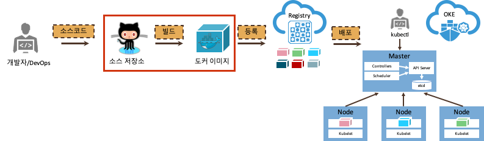

# 애플리케이션 컨테이너화

## 도커 이미지로 만들기

이번 단계는 위에서 만든 애플리케이션을 도커 이미지로 만드는 과정이다.
도커 이미지를 만들기 위해서 Dockerfile 이 필요하며 미리 생성되어 있다.

1. Dockerfile 살펴보기

    ~~~
    cat Dockerfile
    ~~~

    **hands-on-oke-sample** 디렉토리 내에 Dockerfile 이 있다.  
    이 파일은 도커 이미지를 만들기 위한 설정파일이다.

    ~~~docker
    # Node 버젼 8의 이미지를 기본으로 한다.
    FROM node:alpine

    # 애플리케이션이 위치할 디렉토리를 생성한다.
    WORKDIR /user/src/app

    # npm을 이용하여 필요한 패키지를 설치한다.
    COPY package*.json ./
    RUN npm install

    # 모든 애플리케이션 파일을 복사한다.
    COPY . .

    # 포트를 익스포즈 한다.
    EXPOSE 8080

    # 애플리케이션를 실행한다.
    CMD ["npm", "start"]
    ~~~

1. 도커 이미지 만들기
    ~~~sh
    docker build -t oke-sample .
    ~~~

    다음과 같이 도커 이미지가 만들어집니다.
    
    ~~~sh
    Sending build context to Docker daemon  6.607MB
    Step 1/7 : FROM node:8-alpine
    Trying to pull repository docker.io/library/node ... 
    8-alpine: Pulling from docker.io/library/node
    e6b0cf9c0882: Pull complete 
    93f9cf0467ca: Pull complete 
    a564402f98da: Pull complete 
    b68680f1d28f: Pull complete 
    Digest: sha256:38f7bf07ffd72ac612ec8c829cb20ad416518dbb679768d7733c93175453f4d4
    Status: Downloaded newer image for node:8-alpine
    ---> 2b8fcdc6230a
    Step 2/7 : WORKDIR /user/src/app
    ---> Running in 42fb559539a9
    Removing intermediate container 42fb559539a9
    ---> 854077d73d54
    Step 3/7 : COPY package*.json ./
    ---> 2d07df7eb007
    Step 4/7 : RUN npm install
    ---> Running in 66fe120698d3
    ...
    ~~~

1. 이미지 확인하기

    만들어진 도커 이미지를 확인하기 위하여 다음의 명령을 내립니다.

    ~~~sh
    docker images
    ~~~

    다음과 같이 oke-sample 이 만들어져 있음을 알 수 있다.
    ~~~sh
    REPOSITORY           TAG                 IMAGE ID            CREATED             SIZE
    oke-sample           latest              1323f3fc39e1        2 minutes ago       82.5MB
    node                 8-alpine            2b8fcdc6230a        4 months ago        73.5MB
    shiftyou/oke-mysql   latest              c34069dbe43e        6 months ago        437MB
    ~~~

## 네트워크 생성

1. 도커 컨테이너끼리 통신을 하기 위하여 네트워크를 생성한다.

    ~~~
    docker network create mynet
    ~~~

1. 생성된 네트워크를 확인한다.
    ~~~
    docker network ls
    ~~~

    다음과 같이 리스트가 나온다.
    ~~~
    NETWORK ID          NAME                DRIVER              SCOPE
    6632d666d166        bridge              bridge              local
    1e90eb9fbc84        host                host                local
    71d68d2f56e6        mynet               bridge              local
    b4da934ce7a3        none                null                local
    ~~~

    앞으로는 생성된 네트워크를 사용하기 위하여 docker 명령어 중 `--network mynet` 을 추가해 준다.

# 데이터베이스 시작
<!--
1. 인스턴스 포트 열기

    ~~~sh
    sudo firewall-cmd --add-port=3306/tcp --permanent
    sudo systemctl restart firewalld
    ~~~
-->

1. 기존 MySQL 컨테이너 정지&삭제 하기

    기존의 MySQL은 default 네트워크를 사용한다. 이를 mynet을 사용하게 하기 위해 삭제한다.
    ~~~
    docker stop mydb
    docker rm mydb
    ~~~

1. MySQL 컨테이너 실행하기

    생성된 네트워크를 이용하는 MySQL을 실행한다.
    ~~~
    docker run --network mynet --name mydb -e MYSQL_ROOT_PASSWORD=mypassword -p 3306:3306 -d shiftyou/oke-mysql 
    ~~~

# 애플리케이션을 컨테이너에서 수행하기

앞서 만든 애플리케이션 이미지를 사용하여 컨테이너를 실행해 보도록 한다.

1. 애플리케이션 실행하기

    최종적으로  다음과 같이 애플리케이션을 실행한다.
    ~~~
    docker run --network mynet --name myapp  -e MYSQL_SERVICE_HOST=mydb -d -p 8080:8080 oke-sample
    ~~~

    1. 옵션설정 : 필요한 환경변수 대입하기

        이 애플리케이션은 필요한 환경변수 `MYSQL_SERVICE_HOST`가 있다. 이 환경변수는 mysql 이 서비스 되고 있는 호스트를 나타낸니다. 설정하지 않으면 `localhost`로 대입되어 해당 애플리케이션 이미지에는 mysql이 존재하지 않아 애플리케이션이 동작하지 않습니다. 여기에서는 mysql 이 mydb 라는 이름의 컨테이너로 수행되기에 mydb라고 명명한다.

        도커에서 환경변수의 값은 `-e` 옵션을 사용하여 대입한다.
        ~~~
        -e MYSQL_SERVICE_HOST=mydb
        ~~~

        여러개의 환경변수는 -e 를 계속 반복해 줍니다.
        ~~~
        -e MYSQL_SERVICE_HOST=129.213.149.203 -e MYSQL_SERVICE_USER=test -e MYSQL_SERVICE_PASSWORD=Welcome1 -e MYSQL_SERVICE_DATABASE=sample 
        ~~~

    1. 옵션설정 : 포트 포워딩

        해당 애프리케이션은 8000 포트로 서비스 됩니다. 그래서 같은 포트로 포워딩 하기위해 다음과 같은 옵션을 사용한다. 앞의 8000 은 호스트의 포트이고, 뒤의 8000은 컨테이너의 포트이다.
        ~~~
        -p 8080:8080
        ~~~

1. 컨테이너 정보보기

    현재 운영중인 Container를 출력한다.

    ~~~
    docker ps
    ~~~

    다음과 같이 수행됨을 알 수 있다.
    ~~~
    CONTAINER ID        IMAGE                COMMAND                  CREATED              STATUS              PORTS                               NAMES
    e2880e1c1328        oke-sample           "docker-entrypoint.s…"   20 seconds ago       Up 19 seconds       0.0.0.0:8080->8080/tcp              myapp
    6788ecb29b3a        shiftyou/oke-mysql   "docker-entrypoint.s…"   About a minute ago   Up About a minute   0.0.0.0:3306->3306/tcp, 33060/tcp   mydb
    ~~~

    만약 방금 수행한 oke-sample 애플리케이션이 수행되는 myapp 컨테이너가 수행되지 않으면, mysql이 리슨하기 전에 어플리케이션을 수행하여 접속불가로 시작하지 못한 것이다. 이때는 다시 컨테이너를 시작하면 된다.

    ~~~
    docker start myapp
    ~~~

    그리고 다시 상태를 본다.
    
    ~~~
    docker ps 
    ~~~

1. 테스트 하기

    이전 애플리케이션 테스트와 마찬가지로 클라우드쉘을 사용하여 클라우드의 네트워크를 사용할 수 없어 브라우저로는 접근이 불가능하다. 그래서 curl로 확인해 보도록 한다.

    ~~~
    curl localhost:8080
    ~~~

    HTML 소스가 보일 것이며 성공한 것이다.  
    이로써 애플리케이션을 도커이미지로 만들고, 컨테이너로 수행완료하였다.  

1. 종료하기
    1. 도커로 실행중인 mysql을 종료한다.
        ~~~
        docker stop mydb
        docker rm mydb
        ~~~
    1. 도커로 실행중인 애플리케이션을 종료한다.
        ~~~
        docker stop myapp
        docker rm myapp
        ~~~
    1. 확인한다.
        ~~~
        docker ps -a
        ~~~

---
완료하셨습니다. <a href="javascript:history.back();">뒤로가기</a>

