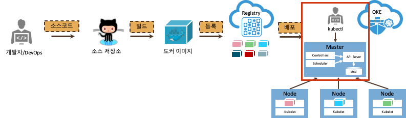
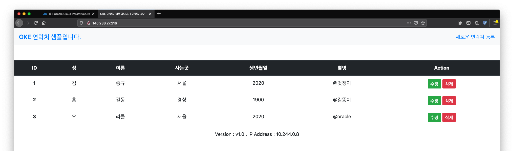
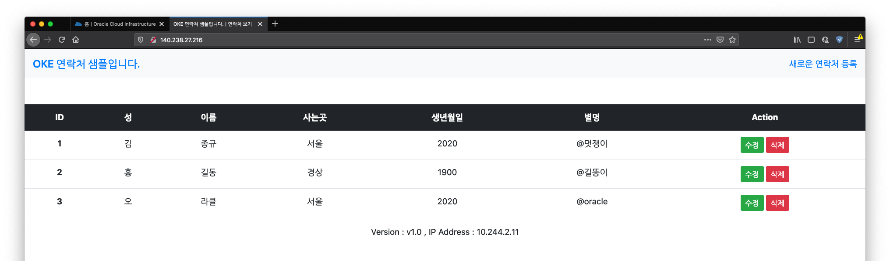
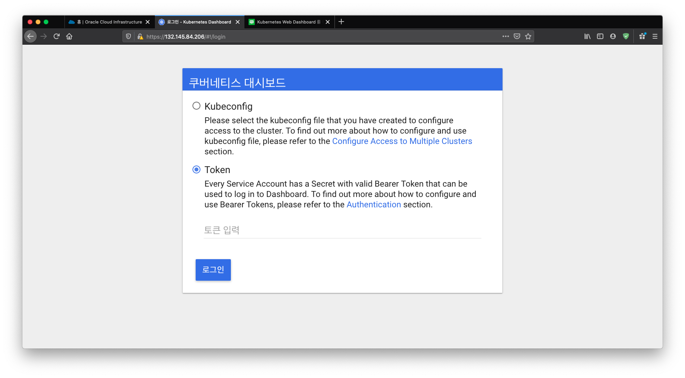
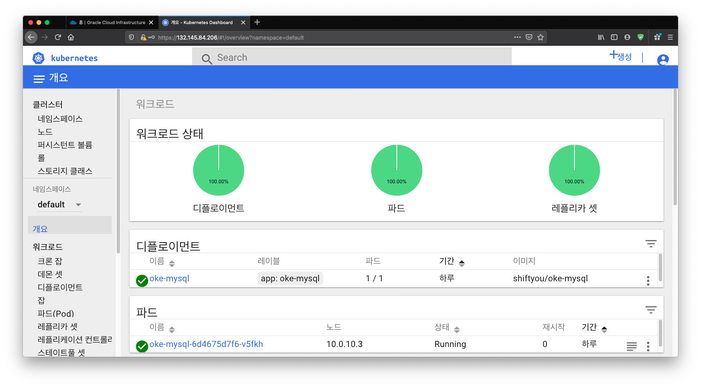

# 애플리케이션 관리하기

## 애플리케이션 상태보기
- 노드 정보

    ~~~
    $ kubectl get node

    NAME        STATUS   ROLES   AGE    VERSION
    10.0.10.2   Ready    node    7d4h   v1.15.7
    10.0.10.3   Ready    node    7d4h   v1.15.7
    10.0.10.4   Ready    node    7d4h   v1.15.7
    ~~~

- Pod 정보

    ~~~
    $ kubectl get pod

    NAME                          READY   STATUS    RESTARTS   AGE
    oke-sample-5d59bb9596-wgk6n   1/1     Running   0          3d22h
    ~~~

- Service 정보

    ~~~
    $ kubectl get service

    NAME         TYPE           CLUSTER-IP    EXTERNAL-IP     PORT(S)        AGE
    oke-sample   LoadBalancer   10.96.6.202   140.238.27.54   80:30151/TCP   3d22h
    ~~~

- Deployment 정보

    ~~~
    $ kubectl get deploy

    NAME         READY   UP-TO-DATE   AVAILABLE   AGE
    oke-sample   1/1     1            1           3d22h
    ~~~

- Replicaset 정보

    ~~~
    $ kubectl get rs

    NAME                    DESIRED   CURRENT   READY   AGE
    oke-sample-5d59bb9596   1         1         1       3d22h
    ~~~

- 한꺼번에 보기

    ~~~
    $ kubectl get all

    NAME                              READY   STATUS    RESTARTS   AGE
    pod/oke-sample-5d59bb9596-wgk6n   1/1     Running   0          3d22h

    NAME                 TYPE           CLUSTER-IP    EXTERNAL-IP     PORT(S)        AGE
    service/oke-sample   LoadBalancer   10.96.6.202   140.238.27.54   80:30151/TCP   3d22h

    NAME                         READY   UP-TO-DATE   AVAILABLE   AGE
    deployment.apps/oke-sample   1/1     1            1           3d22h

    NAME                                    DESIRED   CURRENT   READY   AGE
    replicaset.apps/oke-sample-5d59bb9596   1         1         1       3d22h
    ~~~

- 특정 네임스페이스 보기

    ~~~
    $ kubectl get pod -n default

    NAME                         READY   STATUS    RESTARTS   AGE
    oke-mysql-6d4675d7f6-v5fkh   1/1     Running   0          3d22h
    ~~~

- 전체 네임스페이스 모두 보기

    ~~~
    $ kubectl get pod -A

    NAMESPACE     NAME                                    READY   STATUS    RESTARTS   AGE
    default       oke-mysql-6d4675d7f6-v5fkh              1/1     Running   0          3d22h
    jonggyou      oke-sample-5d59bb9596-wgk6n             1/1     Running   0          3d22h
    kube-system   coredns-69db5796db-75lv5                1/1     Running   0          7d4h
    kube-system   coredns-69db5796db-ttvhj                1/1     Running   0          7d4h
    kube-system   coredns-69db5796db-xfzwv                1/1     Running   0          7d4h
    kube-system   kube-dns-autoscaler-7d678c57cf-fbfkl    1/1     Running   0          7d4h
    kube-system   kube-flannel-ds-qvwkf                   1/1     Running   1          7d4h
    kube-system   kube-flannel-ds-r2jgk                   1/1     Running   1          7d4h
    kube-system   kube-flannel-ds-x5svc                   1/1     Running   1          7d4h
    kube-system   kube-proxy-2cc5r                        1/1     Running   0          7d4h
    kube-system   kube-proxy-2vb9p                        1/1     Running   0          7d4h
    kube-system   kube-proxy-mgvp9                        1/1     Running   0          7d4h
    kube-system   kubernetes-dashboard-668fbf8f68-ghhq5   1/1     Running   0          7d4h
    kube-system   proxymux-client-9954q                   1/1     Running   0          7d4h
    kube-system   proxymux-client-bdkfv                   1/1     Running   0          7d4h
    kube-system   proxymux-client-hvtc5                   1/1     Running   0          7d4h
    ~~~

- 상세보기

    ~~~
    $ kubectl describe pod oke-sample-5d59bb9596-wgk6n

    Name:           oke-sample-5d59bb9596-wgk6n
    Namespace:      jonggyou
    Priority:       0
    Node:           10.0.10.4/10.0.10.4
    Start Time:     Thu, 14 May 2020 08:26:59 +0000
    Labels:         app=oke-sample
                    pod-template-hash=5d59bb9596
    Annotations:    <none>
    Status:         Running
    IP:             10.244.2.7
    Controlled By:  ReplicaSet/oke-sample-5d59bb9596
    Containers:
    oke-sample:
        Container ID:   docker://e0944ddb7dd10349f2a77f36c777cf93442f4c8a58dd35bf4bda9c25b233af2c
        Image:          shiftyou/oke-sample
        Image ID:       docker-pullable://shiftyou/oke-sample@sha256:21b5119d81bf23eaae26616f644de26b647306075e902bacb8c18a7b0e083097
        Port:           8080/TCP
        Host Port:      0/TCP
        State:          Running
        Started:      Thu, 14 May 2020 08:27:03 +0000
        Ready:          True
        Restart Count:  0
        Environment:
        MYSQL_SERVICE_HOST:  oke-mysql.default
        Mounts:
        /var/run/secrets/kubernetes.io/serviceaccount from default-token-jx4ds (ro)
    Conditions:
    Type              Status
    Initialized       True 
    Ready             True 
    ContainersReady   True 
    PodScheduled      True 
    Volumes:
    default-token-jx4ds:
        Type:        Secret (a volume populated by a Secret)
        SecretName:  default-token-jx4ds
        Optional:    false
    QoS Class:       BestEffort
    Node-Selectors:  <none>
    Tolerations:     node.kubernetes.io/not-ready:NoExecute for 300s
                    node.kubernetes.io/unreachable:NoExecute for 300s
    Events:          <none>
    ~~~

- 로그 보기

    ~~~
    $ kubectl get pod
    NAME                          READY   STATUS    RESTARTS   AGE
    oke-sample-5d59bb9596-wgk6n   1/1     Running   0          3d22h

    $ kubectl logs oke-sample-5d59bb9596-wgk6n

    > oke-sample-app@1.0.0 start /user/src/app
    > node app.js

    host:oke-mysql.default
    user:undefined
    password:undefined
    database:undefined
    Server running on port: 8080
    Connected to database
    ~~~

- pod 삭제

    ~~~
    $ kubectl get pod
    NAME                          READY   STATUS    RESTARTS   AGE
    oke-sample-5d59bb9596-wgk6n   1/1     Running   0          3d22h

    $ kubectl delete pod oke-sample-5d59bb9596-wgk6n
    pod "oke-sample-5d59bb9596-wgk6n" deleted

    $ kubectl get pod
    NAME                          READY   STATUS    RESTARTS   AGE
    oke-sample-5d59bb9596-4jw75   1/1     Running   0          21s
    ~~~

## 애플리케이션 확장하기

- 확장

    현재 상태를 봅니다. 현재 1개의 pod 으로 구성되어 있음을 알 수 있습니다.

    ~~~
    $ kubectl get pod
    NAME                          READY   STATUS    RESTARTS   AGE
    oke-sample-5d59bb9596-4jw75   1/1     Running   0          8m1s

    $ kubectl get rs
    NAME                    DESIRED   CURRENT   READY   AGE
    oke-sample-5d59bb9596   1         1         1       3d22h

    $ kubectl get deploy
    NAME         READY   UP-TO-DATE   AVAILABLE   AGE
    oke-sample   1/1     1            1           3d22h
    ~~~

    전체 3개의 pod으로 구성하도록 확장합니다.

    ~~~
    $ kubectl scale deployment/oke-sample --replicas=3
    deployment.extensions/oke-sample scaled
    ~~~

    상태를 살펴봅니다.

    ~~~
    $ kubectl get deploy
    NAME         READY   UP-TO-DATE   AVAILABLE   AGE
    oke-sample   2/3     3            2           3d22h

    $ kubectl get pods
    NAME                          READY   STATUS    RESTARTS   AGE
    oke-sample-5d59bb9596-4jw75   1/1     Running   0          8m3s
    oke-sample-5d59bb9596-s5ngl   1/1     Running   0          27s
    oke-sample-5d59bb9596-xcmw9   1/1     Running   0          27s

    $ kubectl get rs
    NAME                    DESIRED   CURRENT   READY   AGE
    oke-sample-5d59bb9596   3         3         3       3d22h
    ~~~

    서비스의 아이피를 확인합니다.

    ~~~
    $ kubectl get svc

    NAME         TYPE           CLUSTER-IP     EXTERNAL-IP      PORT(S)        AGE
    oke-sample   LoadBalancer   10.96.147.85   140.238.27.216   80:32413/TCP   4m54s
    ~~~
        
    140.238.27.216번 으로 웹브라우저로 접속합니다.
    
    

    화면에서 보이는 IP Address 는 내부 Pod의 IP Address 입니다.      

    F5를 눌러 여러번 리프레쉬를 하면 Service를 통해서 다른 Pod이 불리면 IP Address 항목이 바뀌는 것을 확인합니다.
    
    

    

- pod 삭제

    아래와 같이 xcmw9로 이름된 pod을 삭제하면 새로운 pod 생성됩니다.  
    Replicaset에 의해서 항상 3개의 pod을 유지할 것입니다.

    현재 상태를 봅니다.
    ~~~
    $ kubectl get pods
    
    NAME                          READY   STATUS    RESTARTS   AGE
    oke-sample-5d59bb9596-4jw75   1/1     Running   0          10m
    oke-sample-5d59bb9596-s5ngl   1/1     Running   0          2m38s
    oke-sample-5d59bb9596-xcmw9   1/1     Running   0          2m38s
    ~~~

    한개의 pod을 삭제합니다.
    ~~~
    $ kubectl delete pod oke-sample-5d59bb9596-xcmw9 
    
    pod "oke-sample-5d59bb9596-xcmw9" deleted
    ~~~

    다시 상태를 봅니다.
    ~~~
    $ kubectl get pods
    NAME                          READY   STATUS    RESTARTS   AGE
    oke-sample-5d59bb9596-4jw75   1/1     Running   0          10m
    oke-sample-5d59bb9596-km9xh   1/1     Running   0          7s
    oke-sample-5d59bb9596-s5ngl   1/1     Running   0          2m59s

    $ kubectl get rs
    NAME                    DESIRED   CURRENT   READY   AGE
    oke-sample-5d59bb9596   3         3         3       3d22h

    $ kubectl get deployment
    NAME         READY   UP-TO-DATE   AVAILABLE   AGE
    oke-sample   3/3     3            3           3d22h
    ~~~

- 축소
    
    현재 상태를 확인합니다.
    ~~~
    $ kubectl get pods
    NAME                          READY   STATUS    RESTARTS   AGE
    oke-sample-5d59bb9596-4jw75   1/1     Running   0          14m
    oke-sample-5d59bb9596-km9xh   1/1     Running   0          4m4s
    oke-sample-5d59bb9596-s5ngl   1/1     Running   0          6m56s
    ~~~

    pod의 개수를 2개로 줄입니다.
    ~~~
    $ kubectl scale deployment/oke-sample --replicas=2
    deployment.extensions/oke-sample scaled
    ~~~

    다시 상태를 살펴봅니다.
    ~~~
    $ kubectl get pods
    NAME                          READY   STATUS    RESTARTS   AGE
    oke-sample-5d59bb9596-4jw75   1/1     Running   0          15m
    oke-sample-5d59bb9596-s5ngl   1/1     Running   0          7m39s
    ~~~

- 종료
    
    ~~~
    $ cd yaml

    $ ls
    oke-mysql.yaml  oke-sample.yaml

    $ kubectl delete -f oke-sample.yaml 
    deployment.apps "oke-sample" deleted
    service "oke-sample" deleted

    $ kubectl get pods
    NAME                          READY   STATUS        RESTARTS   AGE
    oke-sample-5d59bb9596-4jw75   0/1     Terminating   0          16m
    oke-sample-5d59bb9596-s5ngl   0/1     Terminating   0          8m39s

    $ kubectl get pods
    No resources found.
    ~~~

## 애플리케이션 업데이트

1. 다시 애플리케이션을 시작합니다.

    ~~~
    $ kubectl apply -f oke-sample.yaml
    deployment.apps/oke-sample created
    service/oke-sample created
    ~~~

    현재 상태를 확인합니다.
    ~~~
    $ kubectl get pods
    NAME                          READY   STATUS    RESTARTS   AGE
    oke-sample-5d59bb9596-mvw5j   1/1     Running   0          18s
    ~~~

    pod을 확장합니다.
    ~~~
    $ kubectl scale deployment/oke-sample --replicas=4
    deployment.extensions/oke-sample scaled
    ~~~

    다시 확인합니다.
    ~~~
    $ kubectl get pods
    NAME                          READY   STATUS    RESTARTS   AGE
    oke-sample-5d59bb9596-7w6ck   1/1     Running   0          19s
    oke-sample-5d59bb9596-8w6gv   1/1     Running   0          19s
    oke-sample-5d59bb9596-jh5js   1/1     Running   0          19s
    oke-sample-5d59bb9596-mvw5j   1/1     Running   0          80s
    ~~~

1. 현재 서비스의 상태를 보면 다음과 같습니다.

    ~~~
    $ kubectl get svc

    NAME         TYPE           CLUSTER-IP     EXTERNAL-IP      PORT(S)        AGE
    oke-sample   LoadBalancer   10.96.147.85   140.238.27.216   80:32413/TCP   4m54s
    ~~~

    세부적인 내용은 다음과 같습니다.
    ~~~
    $ kubectl describe svc

    Name:                     oke-sample
    Namespace:                jonggyou
    Labels:                   app=oke-sample
    Annotations:              kubectl.kubernetes.io/last-applied-configuration:
                                {"apiVersion":"v1","kind":"Service","metadata":{"annotations":{},"labels":{"app":"oke-sample"},"name":"oke-sample","namespace":"jonggyou"}...
    Selector:                 app=oke-sample
    Type:                     LoadBalancer
    IP:                       10.96.147.85
    LoadBalancer Ingress:     140.238.27.216
    Port:                     <unset>  80/TCP
    TargetPort:               8080/TCP
    NodePort:                 <unset>  32413/TCP
    Endpoints:                10.244.0.8:8080,10.244.1.9:8080,10.244.2.11:8080 + 1 more...
    Session Affinity:         None
    External Traffic Policy:  Cluster
    Events:
    Type    Reason                Age    From                Message
    ----    ------                ----   ----                -------
    Normal  EnsuringLoadBalancer  5m7s   service-controller  Ensuring load balancer
    Normal  EnsuredLoadBalancer   4m26s  service-controller  Ensured load balancer
    ~~~

    해당 로드밸런스의 IP로 접근을 합니다.
    

    위에서 보는 바와 같이 `Version:v1.0` 임을 알 수 있습니다.
    
1. 소스 업데이트

    이미 새로운 버젼의 애플리케이션 이미지를 미리 업로드 해 놓았습니다.
    이미지는 `shiftyou/oke-sample:v2` 입니다.

    

    
※ 새로운 버젼의 애플리케이션으로 이미지를 관리하기

    

    버젼을 출력하는 파일을 변경합니다.
    
    ~~~
    $ vi routes/version.js
    ~~~

    현재 버젼을 다른버젼으로 업데이트 하고 저장합니다.

    ~~~
    var version = "v2.0"
    ~~~

    그리고 이미지를 만들고 태그를 변경하여 image를 push 합니다.
    
    ~~~
    $ docker build -t shiftyou/oke-sample:v2 .
    $ docker push shiftyou/oke-sample:v2
    ~~~
    

    

    
1. 애플리케이션 업데이트

    현재상태를 확인합니다.
    ~~~
    $ kubectl rollout status deployment/oke-sample
    deployment "oke-sample" successfully rolled out
    ~~~

    이미지를 업데이트 합니다.

    ~~~
    $ kubectl set image deployments/oke-sample oke-sample=shiftyou/oke-sample:v2
    deployment.extensions/oke-sample image updated
    ~~~

    그리고 빠르게 pod을 살펴보면 다음과 같습니다.

    ~~~
    $ kubectl get pods
    NAME                          READY   STATUS              RESTARTS   AGE
    oke-sample-5d59bb9596-7w6ck   0/1     Terminating         0          16m
    oke-sample-5d59bb9596-8w6gv   0/1     Terminating         0          16m
    oke-sample-5d59bb9596-jh5js   0/1     Terminating         0          16m
    oke-sample-5d59bb9596-mvw5j   1/1     Running             0          17m
    oke-sample-5d7986d67d-cfl5x   1/1     Running             0          9s
    oke-sample-5d7986d67d-pjdnh   1/1     Running             0          9s
    oke-sample-5d7986d67d-txwxt   0/1     ContainerCreating   0          3s
    oke-sample-5d7986d67d-wmlbz   0/1     ContainerCreating   0          3s
    ~~~

    이는 현재 pod을 내리고 새로운 버젼의 pod으로 애플리케이션을 실행하는 것입니다. 다시 확인하면 완료되어있습니다.
    ~~~
    $ kubectl get pods
    NAME                          READY   STATUS    RESTARTS   AGE
    oke-sample-5d7986d67d-cfl5x   1/1     Running   0          16s
    oke-sample-5d7986d67d-pjdnh   1/1     Running   0          16s
    oke-sample-5d7986d67d-txwxt   1/1     Running   0          10s
    oke-sample-5d7986d67d-wmlbz   1/1     Running   0          10s
    ~~~

    이제 브라우저로 접근해 봅니다. 로드밸런스를 변경이 없으니 같은 IP로 접근합니다.

    

    화면에서 보는 바와 같이 `Version:v2.0`으로 변경되었음을 알 수 있습니다.

1. 롤백

    방금전 업데이트 한 애플리케이션을 롤백하는 단계입니다.
    ~~~
    $ kubectl rollout undo deployments/oke-sample
    deployment.extensions/oke-sample rolled back
    ~~~

    다시 브라우저에서 리플레쉬를 합니다.

    

    버젼이 다시 `Version:v1.0`으로 변경되었음을 알 수 있습니다.

## 대시보드

클러스터를 생성할 때 대시보드를 같이 설치하였습니다.  
대시보드는 기본적으로 ClusterIP로 배포되어 외부에서 접근이 불가합니다.  
이를 변경하여 외부에서 접근가능하도록 합니다.

1. 대시보드를 LoadBalancer 서버스로 변경

    ~~~
    $ kubectl edit svc kubernetes-dashboard -n kube-system
    ~~~
    type 을 `LoadBalancer` 로 변경합니다.

    외부 IP를 확인합니다.

    ~~~
    $ kubectl get svc -n kube-system
    ~~~

1. 브라우저로 접속 
 
    접속하면, 로그인을 하기 위하여 토큰을 입력해야 합니다.
    
    

1. 토큰을 얻기

    토큰은 다음과 같이 얻을 수 있습니다. 

    ~~~
    $ TOKENNAME=`kubectl -n kube-system get serviceaccount/kubernetes-dashboard -o jsonpath='{.secrets[0].name}'`

    $ TOKEN=`kubectl -n kube-system get secret $TOKENNAME -o jsonpath='{.data.token}'| base64 --decode`

    $ echo $TOKEN
    ~~~

    출력된 토튼의 값을 복사하여 로그인을 합니다.

    로그인이 완료되면 다음과 같이 화면이 나옵니다. 
    
    

>    만약 권한이 없다는 오류가 뜨면 다음과 같이 명령합니다.
>
>    ~~~
>    $ kubectl create clusterrolebinding kubernetes-dashboard --clusterrole=cluster-admin --serviceaccount=kube-system:kubernetes-dashboard
>    ~~~

---
핸즈온을 완료하였습니다.  
수고하셨습니다.

---
완료하셨습니다. <a href="javascript:history.back();">뒤로가기</a>
