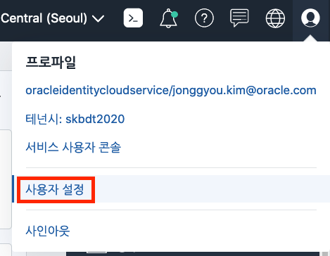
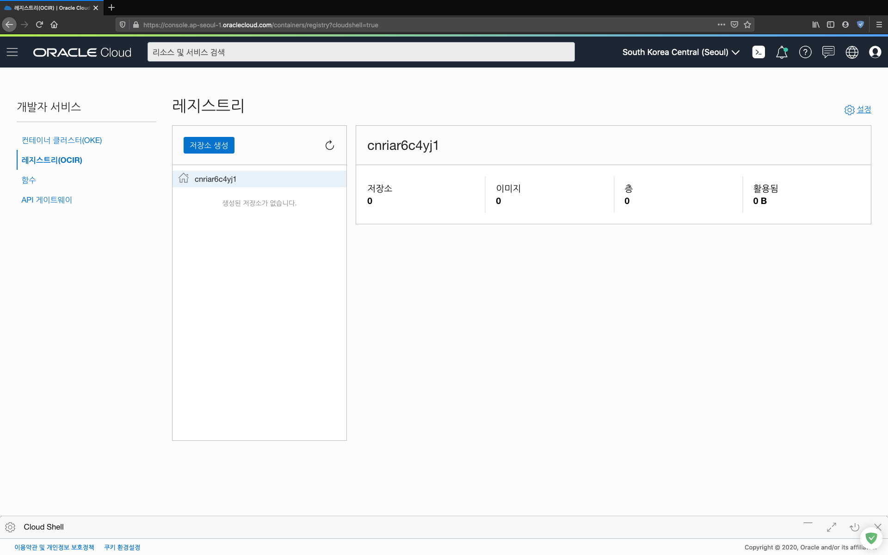
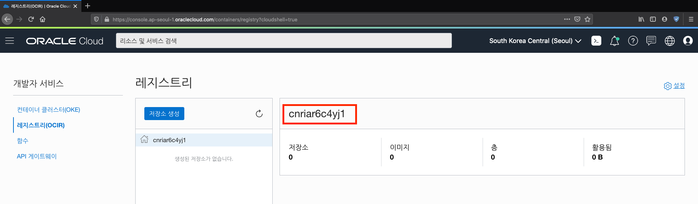
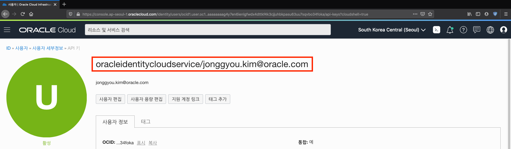
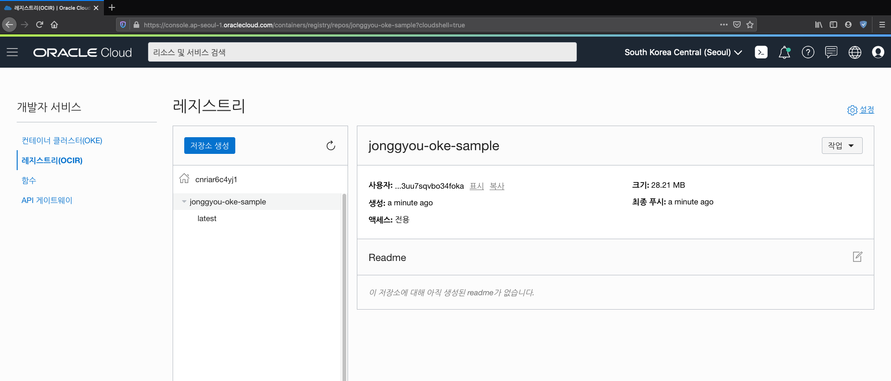
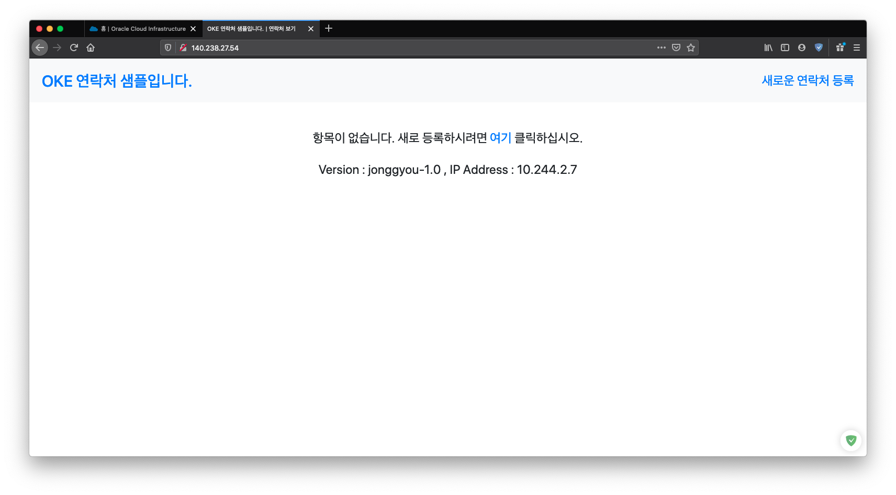

# OKE에 애플리케이션 배포하기

## Docker Registry 에 push 하기

도커 이미지를 레지스트리에 push 하기 위해서는 login을 해야 합니다.

### hub.docker.com 에 푸시하기 - Public

1. login 하기

    기본적으로 push 는 docker.io 에 이미지를 push 한다.  
    자신의 도커 이미지를 push 하기 위해서 docker.io 에 로그인을 한다.

    ~~~
    docker login
    ~~~

    다음과 같이 id/pw를 입력하는 화면이 나오면 입력한다.
    ~~~
    Login with your Docker ID to push and pull images from Docker Hub. If you don't have a Docker ID, head over to https://hub.docker.com to create one.
    Username: <사용자ID>
    Password: <사용자PW>
    WARNING! Your password will be stored unencrypted in /home/jonggyou_k/.docker/config.json.
    Configure a credential helper to remove this warning. See
    https://docs.docker.com/engine/reference/commandline/login/#credentials-store

    Login Succeeded
    ~~~

1. tag 생성

    이전 항목에서 우리는 oke-sample 이라는 docker image를 생성하였다.  
    Docker Hub 내의 자신의 ID에 이미지를 두기 위해서는 Tag명이 **<사용자ID>/<이미지명>** 이어야 한다.
    ~~~
    docker tag oke-sample <사용자ID>/oke-sample
    ~~~

    아래와 같이 확인하면 새로운 Tag명으로 생성된 docker image가 보인다.
    ~~~
    $ docker tag oke-sample shiftyou/oke-sample
    $ docker images

    REPOSITORY            TAG                 IMAGE ID            CREATED              SIZE
    oke-sample            latest              b3851a172fd8        About a minute ago   82.5MB
    shiftyou/oke-sample   latest              b3851a172fd8        About a minute ago   82.5MB
    node                  8-alpine            2b8fcdc6230a        4 months ago         73.5MB
    ~~~

1. push 하기
    ~~~
    docker push <사용자ID>/<이미지명>
    ~~~
    아래와 같이 docker.io 에 `<사용자ID>/이미지명` 으로 push 하는 로그들이 나오고 완료된다.
    ~~~
    $ docker push shiftyou/oke-sample

    The push refers to repository [docker.io/shiftyou/oke-sample]
    9ad596b6507c: Preparing 
    89015aa9a76a: Preparing 
    7d76b70f6e3c: Preparing 
    8e27730a26d6: Preparing 
    6b73202914ee: Preparing 
    9851b6482f16: Waiting 
    540b4f5b2c41: Waiting 
    ...
    ~~~

    >누구나 사용 가능한 이미지로 Kubernetes 에서도 secret 정보 필요없이 사용 가능하다.

### OCIR(Oracle Cloud Infrastructure Registry)에 푸시하기 - Private

1. token 만들기

    Private한 환경인 OCIR에 이미지를 push 하기 위해서는 인증토큰이 필요하다.

    1. 우측 상단의  아이콘을 클릭하고 `사용자 설정` 을 선택한다.

        

    1. 좌측의 리스트에서 `인증토큰`을 선택한다.

        

    1. `토큰 생성`을 선택하여 설명부분에 설명을 쓰고 토큰을 생성한다.  

        한번 생성된 토큰은 다시 볼 수 없기에 생성되고 나면 복사를 해 둔다.

1. login 하기

    좌측 상위메뉴에서 `개발자서비스` >`레지스트리(OCIR)`을 선택하면 다음과 같은 화면이 보여진다.

    

    위 화면에서 *cnriar6c4yj1* 라는 명이 태넌시 명이다. 이를 이용하여 로그인을 한다.

    현재 Seoul 리젼을 쓰기 때문에 icn.ocir.io 에 로그인을 한다.
    ~~~
    docker login icn.ocir.io
    ~~~

    입력할 항목은 영역에는 다음을 입력한다.
    ~~~html
     Username : <태넌트ID>/<사용자ID> 
     Password : <토큰>
    ~~~

    입력사항은 다음에서 찾을 수 있다.

    1. 좌측 상위메뉴에서 `개발자서비스` >`레지스트리(OCIR)`을 선택하면 다음과 같은 화면이 보여진다.

        

        빨간 박스 부분이 <태넌트ID>이다. 

    2. 우측 상단의  아이콘을 클릭하고 `사용자 설정` 을 선택한다.

        

        
        빨간 박스 부분이 <사용자ID>이다. 

    Username 항목에는 위의 <태넌트ID>/<사용자ID> 를 입력한다. 위의 화면을 예를 들면 다음과 같다.
    ~~~
    cnriar6c4yj1/oracleidentitycloudservice/jonggyou.kim@oracle.com
    ~~~

    그리고 패스워드는 이전에 기록한 토큰을 사용한다.

    ~~~
    $ docker login icn.ocir.io

    Username: cnriar6c4yj1/oracleidentitycloudservice/jonggyou.kim@oracle.com
    Password: 
    WARNING! Your password will be stored unencrypted in /home/jonggyou_k/.docker/config.json.
    Configure a credential helper to remove this warning. See
    https://docs.docker.com/engine/reference/commandline/login/#credentials-store

    Login Succeeded
    ~~~

    `` ``

1. tag 생성

    OCIR에 이미지를 두기 위해서는 Tag명이 `<OCIR>/<태넌트ID>/<이미지명>` 이어야 한다.  
    사용자별 또는 프로젝트별로 관리하기 위하여 `<이미지명>`을 `<사용자ID>-oke-sample` 으로 구성하도록 한다.

    ~~~
    docker tag oke-sample <OCIR>/<태넌트ID>/<사용자ID>-oke-sample
    ~~~
    - \<OCIR> : icn.ocir.io
    - \<태넌트ID> : cnriar6c4yj1
    - \<이미지명> : jonggyou-oke-sample

    아래와 같이 확인하면 새로운 Tag명으로 생성된 docker image가 보인다.
    ~~~
    $ docker tag oke-sample icn.ocir.io/cnriar6c4yj1/jonggyou-oke-sample
    $ docker images

    REPOSITORY                                     TAG                 IMAGE ID            CREATED             SIZE
    shiftyou/oke-sample                            latest              b3851a172fd8        2 hours ago         82.5MB
    icn.ocir.io/cnriar6c4yj1/jonggyou-oke-sample   latest              b3851a172fd8        2 hours ago         82.5MB
    oke-sample                                     latest              b3851a172fd8        2 hours ago         82.5MB
    node                                           8-alpine            2b8fcdc6230a        4 months ago        73.5MB
    ~~~

1. push 하기

    ~~~
    $ docker push icn.ocir.io/cnriar6c4yj1/jonggyou-oke-sample

    The push refers to repository [icn.ocir.io/cnriar6c4yj1/jonggyou-oke-sample]
    9ad596b6507c: Pushed 
    89015aa9a76a: Pushed 
    7d76b70f6e3c: Pushed 
    8e27730a26d6: Pushed 
    6b73202914ee: Pushed 
    9851b6482f16: Pushed 
    540b4f5b2c41: Pushed 
    6b27de954cca: Pushed 
    latest: digest: sha256:bdc0574ee9b802e075df623f052a3d7b981fcb4e883d6d67e8489de445407521 size: 1993
    ~~~

    다음과 같이 OCIR에 등록되었음을 알 수 있다.

    

    >인증된 사용자만 pull 할 수 있는 이미지로 Kubernetes에서 sercret 정보 설정이 필요하다.

## OKE에 배포하기

OKE는 오라클에서 제공하는 쿠버네티스 환경이다. 따라서 여타 다른 쿠버네티스 운영과 동일하게 한다.

현재 `yaml` 디렉토리에 보면 배포를 위한 yaml 파일이 두개 있다.
- oke-mysql.yaml : DB 배포를 위한 yaml
- oke-sample.yaml : APP 배포를 위한 yaml

위 두개의 yaml 파일로 배포를 한다.

### MySQL 배포하기

oke-mysql.yaml은 다음의 내용을 포함한다.
~~~yaml
apiVersion: apps/v1
kind: Deployment
metadata:
  name: oke-mysql
  namespace: default
  labels:
    app: oke-mysql
spec:
  selector:
    matchLabels:
      app: oke-mysql
  strategy:
    type: Recreate
  template:
    metadata:
      labels:
        app: oke-mysql
    spec:
      containers:
        - name: oke-mysql
          image: shiftyou/oke-mysql
          ports:
          - containerPort: 3306
            name: oke-mysql
          env:
          - name: MYSQL_ROOT_PASSWORD
            value: mypassword
---
apiVersion: v1
kind: Service
metadata:
  name: oke-mysql
  namespace: default
  labels:
    app: oke-mysql
spec:
  ports:
  - port: 3306
  selector:
    app: oke-mysql
  type: ClusterIP
~~~

1. Deployment 

- 애플리케이션의 이름은 oke-mysql 으로 한다.
- 이미지는 shiftyou/oke-mysql 이미지를 사용한다.
- 포트는 3306번을 사용한다.
- 환경변수로 MYSQL_ROOT_PASSWORD 값으로 mypassword를 사용한다.
- namespace는 default로 한다.

1. Service

- oke-mysql 로 명명된 Deployment를 Service 로 노출한다.
- 서비스는 ClusterIP 타입이다.
- 포트는 3306번이다.
- namespace는 default로 한다.

1. 배포

MySQL은 각자 배포하지 않고 하나만 배포하도록 한다. 그래서 default 네임스페이스에 배포하도록 구성되어 있다.

만약 두번째 이상 배포하려 한다면 이미 배포되었기 때문에 변경사항이 없다.

배포는 다음과 같이 한다.
~~~
kubectl apply -f oke-mysql.yaml
~~~

다음과 같이 현재 배포 상태를 볼 수 있다.
~~~
kubectl get all -n default
~~~

`-n default`는 현재 oke-mysql 이름의 서비스가 default 라는 이름의 네임스페이스에 배포가 되도록 구성되고 배포되어 있다. 그래서 default 라는 이름의 네임스페이스의 상태를 보기 위해서 `-n default`를 옵션으로 준다.

옵션을 주지 않으면 이전에 `kubectl config set-context --current --namespace jonggyou` 라고 명령하여 변경된 기본 네임스페이스를 사용한다.

결과로 다음과 같이 출력된다.
~~~
NAME                             READY   STATUS    RESTARTS   AGE
pod/oke-mysql-6d4675d7f6-v5fkh   1/1     Running   0          2m18s

NAME                 TYPE        CLUSTER-IP    EXTERNAL-IP   PORT(S)    AGE
service/kubernetes   ClusterIP   10.96.0.1     <none>        443/TCP    3d6h
service/oke-mysql    ClusterIP   10.96.49.43   <none>        3306/TCP   2m18s

NAME                        READY   UP-TO-DATE   AVAILABLE   AGE
deployment.apps/oke-mysql   1/1     1            1           2m18s

NAME                                   DESIRED   CURRENT   READY   AGE
replicaset.apps/oke-mysql-6d4675d7f6   1         1         1       2m18s
~~~

### 애플리케이션 배포하기

oke-sample.yaml 은 다음의 내용을 포함한다.
~~~yaml
apiVersion: apps/v1
kind: Deployment
metadata:
  name: oke-sample
  labels:
    app: oke-sample
spec:
  selector:
    matchLabels:
      app: oke-sample
  template:
    metadata:
      labels:
        app: oke-sample
    spec:
      containers:
      - name: oke-sample
        image: shiftyou/oke-sample
        env:
        - name: MYSQL_SERVICE_HOST
          value: oke-mysql.default
        ports:
        - containerPort: 8080
          name: oke-sample
---
apiVersion: v1
kind: Service
metadata:
  name: oke-sample
  labels:
    app: oke-sample
spec:
  ports:
  - port: 80
    targetPort: 8080
  selector:
    app: oke-sample
  type: LoadBalancer
  ~~~

1. Deployment 

- 애플리케이션의 이름은 oke-sample 으로 한다.
- 이미지는 shiftyou/oke-sample 이미지를 사용한다.
- 포트는 8008번으을 사용한다.
- 환경변수로 MYSQL_SERVICE_HOST 값으로 oke-mysql.default를 사용한다.
- namespace는 현재 기본 namespace를 한다.

1. Service

- oke-sample 로 명명된 Deployment를 Service 로 노출한다.
- 서비스는 LoadBalancer 타입이다.
- 포트는 80번을 사용한다. 타겟포트는 8080이다.
- namespace는 현재 기본 namespace를 한다.

1. 배포

yaml 파일에서 보듯이 mysql의 주소를 `oke-mysql.default` 라고 하였다. 이는 default 네임스페이스에 서비스 하고 있는 oke-mysql 를 지정하는 것이다.

다음과 같이 배포한다.
~~~
kubectl apply -f oke-sample.yaml
~~~

그리고 상태는 oke-mysql을 배포했을 때와 다르게 `-n default`라는 옵션이 필요없다. 굳이 한다면 `-n jonggyou`로 하지만 안 해도 기본으로 지정한 jonggyou 네임스페이스를 사용한다.

~~~
kubectl get all
~~~

다음과 같이 잘 배포되어 서비스됨이 출력된다.
~~~
NAME                              READY   STATUS    RESTARTS   AGE
pod/oke-sample-5d59bb9596-wgk6n   1/1     Running   0          11s

NAME                 TYPE           CLUSTER-IP    EXTERNAL-IP   PORT(S)        AGE
service/oke-sample   LoadBalancer   10.96.6.202   <pending>     80:30151/TCP   11s

NAME                         READY   UP-TO-DATE   AVAILABLE   AGE
deployment.apps/oke-sample   1/1     1            1           11s

NAME                                    DESIRED   CURRENT   READY   AGE
replicaset.apps/oke-sample-5d59bb9596   1         1         1       11s
~~~

출력중에 Service 부분을 보면 LoadBalancer 를 사용하는데, 아직 EXTERNAL-IP는 준비 중으로 보인다.
~~~
NAME                 TYPE           CLUSTER-IP    EXTERNAL-IP   PORT(S)        AGE
service/oke-sample   LoadBalancer   10.96.6.202   <pending>     80:30151/TCP   11s
~~~

이는 OCI의 로드밸런서 서비스를 프로비져닝 하고 있음을 의미한다.
다시 service 에 대해서 설펴보도록 한다.
~~~
kubectl get svc
~~~
그러면 다음과 같이 EXTERNAL-IP가 나타난다.
~~~
NAME         TYPE           CLUSTER-IP    EXTERNAL-IP     PORT(S)        AGE
oke-sample   LoadBalancer   10.96.6.202   140.238.27.54   80:30151/TCP   5m41s
~~~

## 테스트 하기

앞서 본 oke-sample 애플리케이션은 로드밸런서로 서비스 중이며, 이 아이피는 EXTERNAL-IP인  140.238.27.54 으로 나타난다. 그리고 포트는 80 포트로 서비스 중이며 내부에서는 8080으로 포워딩 한다.

브라우저를 사용하여 140.238.27.54:80 로 접속해 보도록 한다.

---
완료하셨습니다. <a href="javascript:history.back();">뒤로가기</a>
